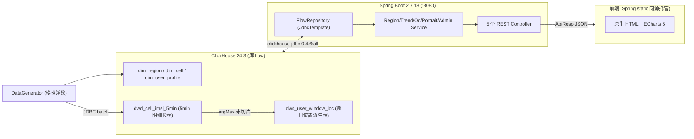
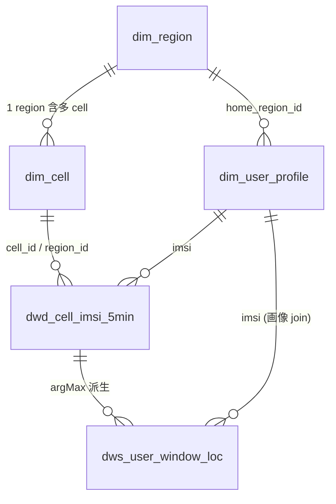

# 系统设计

区域性别及人群流入流出离线分析系统。本文档描述系统的总体架构、技术选型、数据库设计、数据生成、分析算法、接口、前端和部署方案。所有内容与已实现代码保持一致。

---

## 1. 总体架构

系统是一条单向的离线分析数据流水线，外加一层对外可视化。数据在 ClickHouse 里完成清洗、派生与聚合，Spring Boot 通过 JdbcTemplate 直连 ClickHouse 执行分析 SQL 并以 REST API 暴露结果，前端用原生 HTML + ECharts 渲染看板。



数据流向自下而上：

1. `DataGenerator` 生成模拟轨迹明细写入 `dwd_cell_imsi_5min`，并派生窗口位置到 `dws_user_window_loc`。
2. 分析 SQL 全部基于 `dws_user_window_loc` 的相邻窗口自连接（OD 自连接），`FlowRepository` 用 `JdbcTemplate` 执行。
3. 5 个 Controller 把结果包成统一的 `ApiResp` 返回。
4. 前端静态资源由 Spring Boot 同源托管（`/static/`），用相对路径 `/api/...` 调后端，ECharts 出图。

关键设计点：明细用长表（一行一个在网 IMSI），再派生出「用户-窗口-位置」表，使所有流动 SQL 简化成一次相邻窗口的 self-join。

---

## 2. 技术选型与理由

| 组件 | 选型 | 理由 |
|---|---|---|
| JDK | 17 (Corretto) | 本机无 JDK 8，可用 17/11；17 是 Spring Boot 2.7 官方支持的 LTS。 |
| 应用框架 | Spring Boot 2.7.18 | 支持 Java 17，无需迁移到 Jakarta 命名空间；JdbcTemplate 开箱即用。不升级 Spring Boot 3 以规避 jakarta 迁移风险。 |
| 分析数据库 | ClickHouse 24.3（docker 单节点） | 列存 + 向量化执行，适合千万级明细的窗口聚合与 self-join；docker 起停简单。 |
| JDBC 驱动 | clickhouse-jdbc 0.4.6（classifier=all） | uber jar 自带 HTTP client，Java 17 可用，免装额外依赖。 |
| 数据访问 | Spring JdbcTemplate | 分析全是只读聚合 SQL，没有复杂对象映射需求；直接写 SQL 比 ORM 更透明、口径可控。不引入 MyBatis/JPA。 |
| 前端 | 原生 HTML + JS + CSS + ECharts 5 | 看板是只读展示，无需 Vue/React 与构建工具；ECharts 本地化（`lib/echarts.min.js`）离线可用。 |

明确不引入的组件：Kafka、Flink、MyBatis/JPA、鉴权模块。系统是离线批处理 + 只读看板，这些组件没有必要。

---

## 3. 数据库设计

库名 `flow`，共 5 张表：3 张维度表、1 张明细长表、1 张派生汇总表。

### 3.1 ER 关系



### 3.2 DDL 摘要

```sql
-- 区域维度（3 个 region）
CREATE TABLE IF NOT EXISTS flow.dim_region
(
    region_id   String,
    region_name String,
    city_code   String,
    lac         String,
    cell_count  UInt8
)
ENGINE = MergeTree
ORDER BY region_id;

-- 小区维度（8 个 cell）
CREATE TABLE IF NOT EXISTS flow.dim_cell
(
    cell_id   String,
    region_id String,
    lac       String,
    city_code String
)
ENGINE = MergeTree
ORDER BY cell_id;

-- 用户画像维度（10000 用户）
CREATE TABLE IF NOT EXISTS flow.dim_user_profile
(
    imsi           String,
    gender         Enum8('男' = 1, '女' = 2),
    age            UInt8,
    age_group      String,
    is_resident    UInt8,
    home_region_id String
)
ENGINE = ReplacingMergeTree
ORDER BY imsi;

-- 5 分钟粒度小区-IMSI 明细长表（一行一个在网 IMSI）
CREATE TABLE IF NOT EXISTS flow.dwd_cell_imsi_5min
(
    stat_time DateTime('Asia/Shanghai'),
    stat_date Date,
    city_code  String,
    lac        String,
    cell_id    String,
    region_id  String,
    imsi       String
)
ENGINE = MergeTree
PARTITION BY stat_date
ORDER BY (region_id, stat_time, imsi);

-- 用户窗口位置派生表（granularity = hour | day）
CREATE TABLE IF NOT EXISTS flow.dws_user_window_loc
(
    imsi         String,
    granularity  Enum8('hour' = 1, 'day' = 2),
    window_start DateTime('Asia/Shanghai'),
    region_id    String
)
ENGINE = MergeTree
ORDER BY (granularity, window_start, imsi);
```

### 3.3 engine / partition / 时区选择

- **ENGINE**：维度表与事实表用 `MergeTree`。`dim_user_profile` 用 `ReplacingMergeTree`（ORDER BY imsi），支持后续按 imsi 去重 UPSERT。
- **PARTITION**：只有 `dwd_cell_imsi_5min` 按 `stat_date` 分区。明细表行数千万级，按天分区让灌数 TRUNCATE 重灌、按区间扫描都能裁剪分区。其余表数据量小，不分区。
- **ORDER BY（主键）**：明细表 `ORDER BY (region_id, stat_time, imsi)` 贴合「按区域 + 时间」的扫描；派生表 `ORDER BY (granularity, window_start, imsi)` 贴合所有分析 SQL「先按粒度和窗口过滤、再按 imsi self-join」的访问模式。
- **时区**：三处统一 `Asia/Shanghai`，互相对齐：
  1. docker 容器 `TZ=Asia/Shanghai`；
  2. DDL 里时间列声明 `DateTime('Asia/Shanghai')`；
  3. JDBC URL 带 `use_time_zone=Asia/Shanghai`。
  三处一致，时间在写入、存储、读取链路上不发生偏移。

### 3.4 派生表 dws_user_window_loc 的设计理由

这是整个系统的核心设计。明细表里一个用户在一个小时窗口内可能出现在多个 5min 切片、多个 cell，直接做流动分析要先解决「这个窗口里这个用户到底算在哪个区」的问题。

解决办法是预先把每个用户在每个窗口的位置定死，落到一张派生表：

- **统一 loc 口径**：窗口内**最后一个 5min 切片**所在 region，用 `argMax(region_id, stat_time)` 取末切片。配合数据生成时「每个切片只在一个 cell」，loc 完全确定、唯一（已被不变式测试验证 `uniqExact(region_id) == 1`）。
- **两种粒度**：同时派生 `hour` 与 `day` 两个粒度的窗口位置，前端可切换。
- **带来的收益**：有了「用户-窗口-唯一位置」表，所有流动分析就退化成一次相邻窗口的 self-join（见第 5 节），无需在分析 SQL 里再处理多 cell 去重，口径单一、SQL 简单、性能好。

派生 SQL（数据生成阶段执行）：

```sql
INSERT INTO flow.dws_user_window_loc
SELECT imsi, 'hour', toStartOfHour(stat_time), argMax(region_id, stat_time)
FROM flow.dwd_cell_imsi_5min
GROUP BY imsi, toStartOfHour(stat_time);
-- day 粒度同理，用 toStartOfDay
```

---

## 4. 数据生成设计

由 `org.example.flow.datagen.DataGenerator`（`@Component`，方法 `generate()` 返回 `GenResult`）实现，可被 `POST /api/admin/init-data` 复用。配置在 `application.yml` 的 `app.datagen` 下。

### 4.1 用户池（user pool）

- `user-count = 10000`。第 i 个用户的 imsi = `MD5("user_" + i)` 的小写十六进制（模块自实现 `java.security.MessageDigest`）。
- 画像随机分布：
  - gender male-ratio = 0.55；
  - age 按权重 `{0.05, 0.15, 0.25, 0.25, 0.20, 0.10}` 选 6 个年龄段桶，桶内均匀取整。桶边界 `AGE_LO{1,18,26,36,46,61}` / `AGE_HI{17,25,35,45,60,90}`，与 `ProfileConst.ageGroup()` 完全对齐；
  - is_resident = 0.60；
  - home_region 在 3 个 region 中等概率分布。

### 4.2 轨迹模型

每个用户维护一个 current region（初始 = home_region）。按 5min 步进遍历整个时间范围，对每个切片：

1. **present 概率**：`present-prob = 0.9` 判定是否在线。离线则不产生任何行（方案 A，离线不计入流动）。
2. **stay 概率**：在线时 `stay-prob = 0.85` 留在当前 region，否则等概率跳到另外两个 region 之一。
3. **单 cell**：确定 region 后，在该 region 的 cell 列表里随机选 1 个 cell。

因此每个 `(imsi, slice)` 恰好产生 1 行、落在 1 个 cell。这保证了第 3.4 节 loc 的唯一性。

### 4.3 固定 seed 与 warm-up

- **固定 seed = 20260601**：所有随机过程基于此 seed，保证生成结果可复现（被测试验证）。
- **warm-up**：生成区间 `start = 2026-05-31T00:00:00`，但报告/分析区间从 `report-start = 2026-06-01T00:00:00` 开始，`end = 2026-06-07T00:00:00`。提前一天预热，使 06-01 第一个窗口也有「上一窗口」可做相邻 self-join，避免边界窗口缺失 prev。

### 4.4 loc 派生

明细灌完后，用 argMax 一次性派生 hour / day 两个粒度（见 3.4 的 INSERT...SELECT）。

### 4.5 幂等

`generate()` 开头 `TRUNCATE` 事实表 / 派生表 / 画像表（不动 `dim_region` / `dim_cell` 静态维度），再重新生成。多次调用结果一致。

### 4.6 生成规模（seed=20260601, userCount=10000 基线）

| 表 | 行数 |
|---|---|
| dim_user_profile | 10,000 |
| dwd_cell_imsi_5min | 18,144,589 |
| dws_user_window_loc (hour) | 1,680,000 |
| dws_user_window_loc (day) | 70,000 |

单次 `generate()` 耗时约 155~169 秒（JDBC PreparedStatement batch，batch-size=10000）。

---

## 5. 分析算法设计

所有指标口径全系统唯一，禁止第二套。核心是「一切从 OD 派生」。

### 5.1 统一 loc 与 OD self-join

loc 已在派生表里定死（窗口末切片 region）。OD（Origin-Destination）= 相邻窗口的自连接：

```sql
SELECT prev.region_id   AS from_region,
       cur.region_id    AS to_region,
       cur.window_start AS window_start,
       count()          AS flow
FROM flow.dws_user_window_loc cur
INNER JOIN flow.dws_user_window_loc prev
        ON cur.imsi = prev.imsi
       AND cur.granularity = prev.granularity
       AND prev.window_start = cur.window_start - INTERVAL 1 HOUR   -- day 时为 INTERVAL 1 DAY
WHERE cur.granularity = ?
  AND cur.window_start >= ?
  AND cur.window_start <  ?
GROUP BY from_region, to_region, window_start
ORDER BY window_start, from_region, to_region;
```

要点：

- **transition-only（方案 A）**：派生表「在线才有行」，相邻窗口 `INNER JOIN` 天然只保留两个窗口都在网的用户。离线 / 上线不计入流动，不引入 OFFLINE 伪区域。
- **对角线 = retained**：`from == to` 表示用户在相邻两个窗口都在同一区，即留存。
- **step 随粒度变化**：hour 用 `INTERVAL 1 HOUR`，day 用 `INTERVAL 1 DAY`。INTERVAL 步长不能用 `?` 参数化，故 `SqlConst` 拆出 `OD_HOUR` / `OD_DAY` 两个常量（仅 step 不同），由 `od(Granularity)` 选择。

### 5.2 trend / portrait 从 OD 派生

**trend**（指定 region R 的时序）外层对 OD 子查询做 `sumIf` 聚合：

```
inflow(R,T)     = Σ OD(R'→R, T)   where R' ≠ R    = sumIf(flow, to=R   AND from!=R)
outflow(R,T)    = Σ OD(R→R', T)   where R' ≠ R    = sumIf(flow, from=R AND to!=R)
retained(R,T)   = OD(R→R, T)                       = sumIf(flow, from=R AND to=R)
population(R,T) = retained + inflow
```

内层 OD 子查询额外加 `(cur.region_id = R OR prev.region_id = R)`，作用有二：① 限定到与 R 相关的行，提速；② 不存在的 region 自然返回空结果集（0 行，不报错），满足空输入契约。trend 的位置参数共 15 个（`?1..?10` = R 在 select 内重复、`?11` = granularity、`?12` = start、`?13` = end、`?14`/`?15` = R 在内层过滤）。

**portrait**（流入 / 流出人群画像）的用户集合也必须来自同一份 OD 自连接：

- `direction = in`：`to_region = R AND from_region != R`，取 `cur.imsi`；
- `direction = out`：`from_region = R AND to_region != R`，取 `prev.imsi`；
- 再 join `dim_user_profile`，按维度列（gender / age_group / is_resident）`GROUP BY` 计数；
- **计数口径 = 按流动次数计**（OD 行计数，不去重 imsi），使各 bucket 之和严格等于该方向的 flow 总次数，可与 trend 对账。
- 维度列是列名不能用 `?`，由 service 用 `%s` 注入（来源 `PortraitDimension` 枚举白名单，注入安全）；其余 5 个位置参数 `?1`=granularity `?2`=start `?3`=end `?4`=R `?5`=R。

### 5.3 守恒推导

因为 inflow / outflow / retained / population 全部从同一份 OD 派生，守恒天然成立：

- **窗口级守恒**：`population(R,T) = retained(R,T) + inflow(R,T)`（本窗口到达 R 的总人次 = 留守 R 的 + 从别区流入 R 的）。这是 SQL 里 population 的定义式，被不变式测试逐窗口验证。
- **全局守恒**：`Σ_R inflow(R,T) = Σ_R outflow(R,T)`。每一次跨区流动 `OD(A→B)` 在 A 看是 outflow、在 B 看是 inflow，对所有 region 求和后两者必然相等。
- **三向对账**：同区间内 `OD inflow(to=R,from!=R) 之和 == Σ trend.inflow == portrait(in).total`。三个端点同源于一份 OD，数值一致（被集成测试验证）。

实测（T6 数据，R=陆家嘴，hour，窗口 2026-06-01 12:00:00）：`population 3336 = retained 1272 + inflow 2064`；全局 `Σinflow = Σoutflow = 6242`；portrait(in,gender) `男1143 + 女921 = 2064 == inflow`。

---

## 6. 接口设计

统一返回 `ApiResp<T> { code, message, data }`。时间格式 ISO `yyyy-MM-dd'T'HH:mm:ss`（Asia/Shanghai）。

### 6.1 端点总览

| # | Method | Path | 主要参数 | data 类型 |
|---|---|---|---|---|
| 1 | GET | `/api/regions` | 无 | `List<RegionVO>` |
| 2 | GET | `/api/flow/trend` | regionId, granularity, start, end | `List<FlowTrendPoint>` |
| 3 | GET | `/api/flow/od` | granularity, start, end | `List<ODFlow>` |
| 4 | GET | `/api/flow/portrait` | regionId, granularity, start, end, direction, dimension | `PortraitResult` |
| 5 | POST | `/api/admin/init-data` | 无请求体 | `GenResult` |

枚举契约（小写）：granularity ∈ {`hour`,`day`}；direction ∈ {`in`,`out`}；dimension ∈ {`gender`,`age_group`,`is_resident`}。非法枚举 / 缺参 → HTTP 400（`/api/flow/od` 例外，非法 granularity 返回 HTTP 200 + body.code=400）。

### 6.2 Response Schema 与示例

**ApiResp 包装（所有端点）**

| 字段 | 类型 | 说明 |
|---|---|---|
| code | int | HTTP 状态码（200=成功） |
| message | String | "success" 或错误描述 |
| data | T | 业务数据，error 时为 null |

**① GET /api/regions** → `data: RegionVO[]`（按 region_id 升序）

RegionVO：`regionId(String)` / `regionName(String)` / `lac(String)` / `cellCount(int)`

```json
{
  "code": 200,
  "message": "success",
  "data": [
    { "regionId": "310000_6200", "regionName": "徐家汇",   "lac": "6200", "cellCount": 3 },
    { "regionId": "310000_6234", "regionName": "人民广场", "lac": "6234", "cellCount": 2 },
    { "regionId": "310000_6254", "regionName": "陆家嘴",   "lac": "6254", "cellCount": 3 }
  ]
}
```

**② GET /api/flow/trend?regionId=310000_6254&granularity=hour&start=2026-06-01T00:00:00&end=2026-06-02T00:00:00** → `data: FlowTrendPoint[]`（按 windowStart 升序）

FlowTrendPoint：`windowStart(LocalDateTime)` / `population(long)` / `inflow(long)` / `outflow(long)` / `retained(long)`

```json
{
  "code": 200,
  "message": "success",
  "data": [
    { "windowStart": "2026-06-01T12:00:00", "population": 3336, "inflow": 2064, "outflow": 2050, "retained": 1272 }
  ]
}
```

不变式 `population == retained + inflow`。不存在的 regionId 或区间无数据 → `data: []` + HTTP 200。

**③ GET /api/flow/od?granularity=hour&start=2026-06-01T00:00:00&end=2026-06-02T00:00:00** → `data: ODFlow[]`（≤ 3×3=9 项，含对角线）

ODFlow：`fromRegionId(String)` / `fromRegionName(String)` / `toRegionId(String)` / `toRegionName(String)` / `flow(long)`

```json
{
  "code": 200,
  "message": "success",
  "data": [
    { "fromRegionId": "310000_6254", "fromRegionName": "陆家嘴", "toRegionId": "310000_6254", "toRegionName": "陆家嘴",   "flow": 30138 },
    { "fromRegionId": "310000_6254", "fromRegionName": "陆家嘴", "toRegionId": "310000_6234", "toRegionName": "人民广场", "flow": 2222 }
  ]
}
```

区域中文名由 service 用 `RegionDef.regionName(id)` 补；flow 按 (from, to) 在整个区间累加。对角线 from==to 即 retained。

**④ GET /api/flow/portrait?regionId=310000_6254&granularity=hour&start=2026-06-01T12:00:00&end=2026-06-01T13:00:00&direction=in&dimension=gender** → `data: PortraitResult`

PortraitResult：`direction(String)` / `dimension(String)` / `total(long)` / `buckets(List<PortraitBucket>)`
PortraitBucket：`bucket(String)` / `count(long)` / `ratio(double, 0~1)`

```json
{
  "code": 200,
  "message": "success",
  "data": {
    "direction": "in",
    "dimension": "gender",
    "total": 2064,
    "buckets": [
      { "bucket": "男", "count": 1143, "ratio": 0.5538 },
      { "bucket": "女", "count": 921,  "ratio": 0.4462 }
    ]
  }
}
```

各 bucket 的 count 之和 == total == 同区间 inflow（与 trend 对账）。bucket 取值：gender 为 `男`/`女`；is_resident 为 `0`/`1`；age_group 为 6 档字符串（`<18`/`18-25`/`26-35`/`36-45`/`46-60`/`60+`）。total=0 时 ratio=0（防除零）。

**⑤ POST /api/admin/init-data**（无请求体）→ `data: GenResult`

GenResult：`seed(long)` / `userCount(int)` / `profileRows(long)` / `dwdRows(long)` / `dwsHourRows(long)` / `dwsDayRows(long)` / `elapsedMs(long)`

```json
{
  "code": 200,
  "message": "success",
  "data": {
    "seed": 20260601,
    "userCount": 10000,
    "profileRows": 10000,
    "dwdRows": 18144589,
    "dwsHourRows": 1680000,
    "dwsDayRows": 70000,
    "elapsedMs": 160000
  }
}
```

调用会清表重灌（幂等），耗时约 155~169 秒，行数与基线一致即证明可复现。

---

## 7. 前端设计

纯原生 HTML / JS / CSS，无构建工具。静态资源在 `flow-analysis/src/main/resources/static/`，由 Spring Boot 同源托管。ECharts 5 本地化（`lib/echarts.min.js`），离线可用。`api.js` 用相对路径 `/api/...`，自动解包 `ApiResp.data`。

### 7.1 布局

顶部 topbar（控件区 + 图例）→ 概览卡片 `#overview-cards` → 趋势图 → OD 可视化（桑基 + 矩阵表）→ 画像三图。脚本引入顺序：`echarts.min.js → api.js → charts/trend.js → charts/od.js → charts/portrait.js → app.js`。

### 7.2 6 个控件

| 控件 | 取值 | 联动 |
|---|---|---|
| 区域 region | 3 个 option（启动时从 `/api/regions` 动态填充，不硬编码） | change → 全刷（trend+od+portrait） |
| 粒度 granularity | hour / day | change → 全刷 |
| 起始时间 start | datetime-local(step=1) | change → 全刷 |
| 结束时间 end | datetime-local(step=1) | change → 全刷 |
| 方向 direction | in / out | change → 仅刷画像 |
| 维度 dimension | gender / age_group / is_resident | change → 仅刷画像（高亮当前维度） |

时间控件用 `datetime-local`，`normalizeIso` 补秒后以 `yyyy-MM-dd'T'HH:mm:ss` 发 API。另有「初始化数据」按钮：confirm → `POST /api/admin/init-data` → toast → 重载 regions → 全刷。

### 7.3 4 类图表

| 图表 | 容器 id | 类型 |
|---|---|---|
| 趋势 | `#chart-trend` | 折线/面积图，4 系列（在网人数 / 流入 / 流出 / 留存） |
| OD 桑基 | `#chart-od` | sankey 桑基图（跨区链路） |
| OD 矩阵 | `#od-matrix` | N×N HTML 表（含对角线 retained 高亮） |
| 画像 | `#chart-portrait-gender` / `#chart-portrait-age` / `#chart-portrait-resident` | 性别饼图 / 年龄分组柱图 / 常住环图 |

趋势图 x 轴按粒度格式化（hour 到分钟、day 到日），点数 >24 追加 dataZoom；4 系列配色与概览卡片、图例一致。画像图同时拉 in/out 两个方向做对比（年龄是流入/流出分组柱，饼/环图标注对侧）。占比直接用后端 `ratio`，前端不重算。

### 7.4 口径说明面板

页面提供口径说明面板，向用户解释统一口径：transition-only（只统计相邻窗口都在网的用户）、loc = 窗口末切片所在区、population = retained + inflow、portrait 按流动次数计等，避免误读图表数值。

### 7.5 OD 桑基左右二部图避环

3 个 region 两两互流是有环图，标准 sankey 遇到环会报循环错。解法是改画**左右双列二部图**：

- 起点节点名加前缀 `src\x01<name>`（depth 0，label 在右）；
- 终点节点名加前缀 `dst\x01<name>`（depth 1，label 在左）；
- 所有 link 一律 `source = src\x01from → target = dst\x01to`，结构上不可能成环；
- label / tooltip 用正则去前缀显示纯区域名。

过滤掉对角线（from==to）且 flow>0：9 条 → 6 条跨区链路 / 6 节点（3 src + 3 dst）。

---

## 8. 部署设计

前置：本机已装 docker、Maven、JDK 17（Corretto，路径见下）。所有 maven 命令显式指定 JAVA_HOME。

### 步骤 1：起 ClickHouse

```bash
cd flow-analysis/docker
docker-compose up -d
# 等 healthcheck 通过（约 30s），确认容器运行
docker ps | grep clickhouse-flow
```

容器：`clickhouse/clickhouse-server:24.3`，`TZ=Asia/Shanghai`，`CLICKHOUSE_DB=flow`，HTTP 8123 / native 9000，用户 `default` 无密码。

### 步骤 2：建表 + 灌静态维度

```bash
# 建 5 张表（CREATE 全部 IF NOT EXISTS，可重复运行）
for f in flow-analysis/sql/ddl/0[1-5]_*.sql; do
  docker exec -i clickhouse-flow clickhouse-client --multiquery < "$f"
done
# 灌区域/小区维度（多语句文件需 --multiquery）
docker exec -i clickhouse-flow clickhouse-client --multiquery < flow-analysis/sql/ddl/06_dim_data.sql
```

注意：ClickHouse HTTP 接口单次请求不支持多语句，含 TRUNCATE + INSERT 的多语句文件必须经 `clickhouse-client --multiquery` 执行。

### 步骤 3：打包

```bash
export JAVA_HOME=/Users/daiwenxi/Library/Java/JavaVirtualMachines/corretto-17.0.14/Contents/Home
mvn -DskipTests package -f flow-analysis/pom.xml
```

### 步骤 4：启动应用

```bash
java -jar flow-analysis/target/flow-analysis-1.0.0-SNAPSHOT.jar
```

应用监听 `:8080`，通过 JDBC `jdbc:clickhouse://localhost:8123/flow?use_time_zone=Asia/Shanghai` 连库，并同源托管前端静态资源。

### 步骤 5：灌模拟数据（首次必做）

```bash
curl -XPOST http://localhost:8080/api/admin/init-data
# 返回 ApiResp，data 含 seed / 各表行数；耗时约 155~169s
```

也可在启动时自动灌：`mvn spring-boot:run -f flow-analysis/pom.xml -Dspring-boot.run.arguments="--app.datagen.auto-init=true"`（默认 `auto-init=false`）。

### 步骤 6：打开看板

浏览器访问 `http://localhost:8080/`，看板自动加载 3 个区域并渲染趋势、OD、画像图表。前端改动后需重新 `mvn -DskipTests package` 再 `java -jar`（或用 `spring-boot:run`）才会被 :8080 重新托管。
